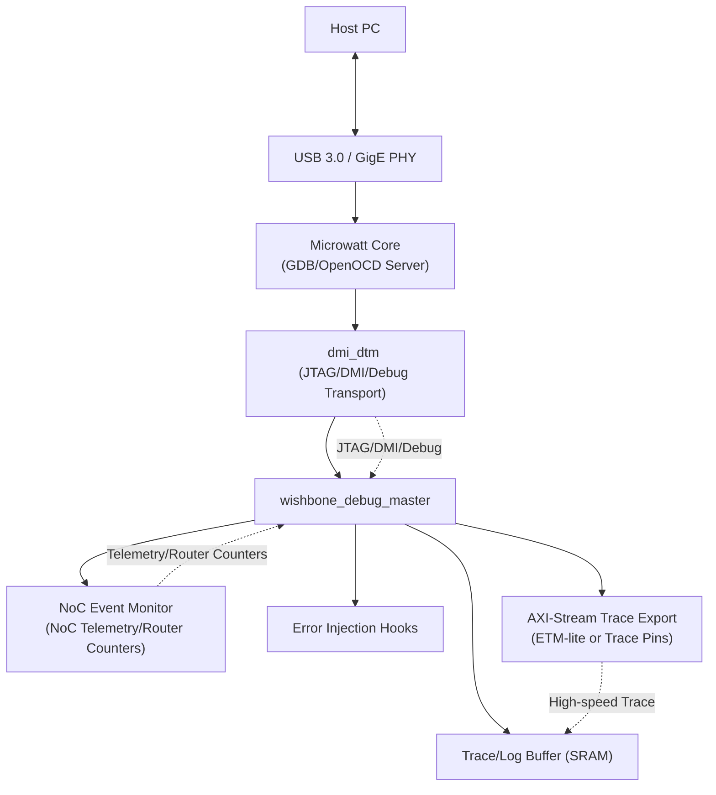

# Microwatt-Based Debugger ASIC 

---

## Getting Started

### SoC Parameters

### SoC Generic Parameters

| Generic name | Type | Value | Description |
|---------------|------|------------------|-------------|
| `MEMORY_SIZE` | `natural` |4096| Total on-chip memory size (implementation specific). |
| `CLK_FREQ` | `positive` | — | System clock frequency (in Hz). |
| `SIM` | `boolean` | `false` | Enable simulation-specific features. |
| `NCPUS` | `positive` | `1` | Number of processor cores. |
| `HAS_FPU` | `boolean` | `true` | Include Floating-Point Unit. |
| `HAS_BTC` | `boolean` | `true` | Include Branch Target Cache. |
| `ALT_RESET_ADDRESS` | `std_logic_vector(63 downto 0)` | `x"00000000F0000000"` | Alternate reset vector address. |
| `HAS_DRAM` | `boolean` | `false` | Enables DRAM interface. |
| `DRAM_SIZE` | `integer` | `0` | DRAM size in implementation-specific units. |
| `DRAM_INIT_SIZE` | `integer` | `0` | Number of DRAM initialization entries. |
| `HAS_SPI_FLASH` | `boolean` | `true` | Enables SPI Flash controller. |
| `SPI_FLASH_DLINES` | `positive` | `4` | Number of SPI data lines (1–4). |
| `SPI_FLASH_OFFSET` | `integer` | `0` | Offset for SPI Flash boot address. |
| `SPI_FLASH_DEF_CKDV` | `natural` | `4` | Default SPI clock divider. |
| `SPI_BOOT_CLOCKS` | `boolean` | `false` | Enable boot clocking during SPI boot. |
| `LOG_LENGTH` | `natural` | `0` | Internal log buffer length. |
| `UART0_IS_16550` | `boolean` | `true` | Make UART0 16550-compatible. |
| `HAS_GPIO` | `boolean` | `true` | Enable GPIO peripheral. |
| `NGPIO` | `natural` | `32` | Number of available GPIO pins. |

### Included Peripherals

| Peripheral   | Function / Interface Type      | Status       |
|---------------|-------------------------------|---------------|
| UART          | Serial communication (16550)  | ✔️ Enabled    |
| USB           | USB Controller      | ✔️ Included |
| JTAG Master   | Debug interface for Target SoC         | ✔️ Included, but not fully tested    |
| SPI Flash     | SPI for boot storage     | ✔️ Enabled    |
| GPIO          | 32-bit general-purpose I/O     | ✔️ Enabled    |


### 1. Building the SoC

The original Microwatt SoC was written in VHDL and designed for FPGA, containing FPGA-specific blocks such as BRAMs and LiteX components.  
To prepare it for ASIC implementation, some modules were replaced and filtered for the same, and the design was converted from VHDL to Verilog using Yosys VHDL plugin(via the ghdl:yosys docker image).

This generated a Verilog version of the full SoC suitable for ASIC flow.

```
docker run --rm -v $PWD:/src:z -w /src hdlc/ghdl:yosys yosys -m ghdl -p " \
ghdl --std=08 --no-formal \
-gMEMORY_SIZE=4096 \
-gSIM=false \
-gUART0_IS_16550=true \
decode_types.vhdl common.vhdl wishbone_types.vhdl fetch1.vhdl utils.vhdl plrufn.vhdl cache_ram.vhdl icache.vhdl predecode.vhdl decode1.vhdl helpers.vhdl insn_helpers.vhdl control.vhdl decode2.vhdl register_file.vhdl cr_file.vhdl crhelpers.vhdl ppc_fx_insns.vhdl rotator.vhdl logical.vhdl countbits.vhdl multiply.vhdl multiply-32s.vhdl divider.vhdl execute1.vhdl loadstore1.vhdl mmu.vhdl dcache.vhdl writeback.vhdl core_debug.vhdl core.vhdl fpu.vhdl pmu.vhdl bitsort.vhdl wishbone_arbiter.vhdl wishbone_bram_wrapper.vhdl sync_fifo.vhdl wishbone_debug_master.vhdl xics.vhdl syscon.vhdl gpio.vhdl soc.vhdl spi_rxtx.vhdl spi_flash_ctrl.vhdl git.vhdl dmi_dtm_dummy.vhdl nonrandom.vhdl main_bram.vhdl \
-e soc; \
hierarchy -check -top soc; \
write_verilog microwatt.v \
"
```
The second challenge included replacing the current cache_ram, register_file and main_bram/main_memory with equivalent sram macros. In the first iteration, sky130 based openram macros were utilized and tested, however due to the prevelant relibility issues, the implementation had to be dropped in the last moment, however options recommended by the organizers( OL-DFFRAM and Commercial Sram) would satisy my main_memory requirements, but can't satisfy the requirements of multiple ports, as presented in the cache_ram and register file. Therefore quite late in the submission, we discoverd DFFRAM compiler, and met our requirements with the same 

```
git clone https://github.com/AUCOHL/DFFRAM.git
cd DFFRAM
nix develop
```

```
./dffram.py 32x64 1RW1R --min-height 180 -c "PIN_ORDER_FILE=ram32_1rw1r_pin_order.cfg"

./dffram.py 512x64 --vertical-halo 100 --horizontal-halo 20 -c "PIN_ORDER_FILE=ram512_pin_order.cfg"

```

---

### 2. Booting from SPI Flash

ASIC systems cannot rely on internal memories for boot, so the SoC must boot from external SPI flash.

A testbench was created where a SPI flash model is instantiated externally and connected to the SoC.  
This flash model sends SPI signals containing the `.hex` firmware file to the SoC during boot.

The `.hex` file is the binary of the firmware (for example, a UART test program).

---

### 3. Verifying UART Functionality

To verify that the SoC boots correctly and runs firmware, a UART verification test was performed:

- The firmware gets loaded from Flash to MM at boot.  
- The firmware initializes UART and runs "echoes", further also writes GPIOs, which is also later monitored in the testbench and verified.
- Data is driven to the UART RX pins. 
- The testbench monitors UART TX to confirm correct transmission.

*Made `alt_reset` an external signal to enable boot from flash.  

---

### 4. USB Controller Integration

To enable high-speed host communication, we integrated our custom USB controller into the SoC.  
The controller was wrapped with a Wishbone interface, allowing it to communicate directly with the Microwatt core and debug master.

Firmware was written to initialize and handle USB transactions, allowing the SoC to send and receive data to/from the host PC, enabling trace export, firmware loading, and debug control over USB.

---

### DV

You can find the dv @ verilog/dv/Caravel/microwatt/uart | usb

#### Steps:

- Download and extract the powerpc64 cross compiler [Download from here!](https://toolchains.bootlin.com/downloads/releases/toolchains/powerpc64le-power8/tarballs/powerpc64le-power8--glibc--stable-2025.08-1.tar.xz) to your /home directory
- Make sure to add the path of powerpc64 binaries to your path environmental variable
```
export PATH=~/powerpc64le-power8--glibc--stable-2025.08-1/bin:$PATH
```
- (For uart test)
```
cd verilog/dv/Caravel/microwatt/uart
make all
```
- (For jtag test)
```
cd verilog/dv/Caravel/microwatt/jtag
make all
```
- Make sure to run `make clean` after performing the test

Here is proof that my microwatt is alive


### Librelane Flow update, the flow is still running, 

latest update, currently @ Detailed Routing  (stage 46)

48 now 


### Debug FLow


### Proposal :

---

## 1. Goal
A **Microwatt-based debugger ASIC** that serves as an **external debug companion chip** for AI accelerators and Network-on-Chip (NoC) systems and leverages Microwatt’s native **Wishbone + JTAG/DMI debug fabric** to control, observe, and analyze external targets at ASIC-level performance.

---

## 2. What This Debugger Adds

**Extended Observability**
- Aggregates debug data across cores, NoCs, DMA, and memory into a unified timeline.  
- Adds scalable trace buffering (using openRAM) for long captures.  
- Enables live monitoring of congestion, stalls, and performance counters.  

**Independent Debug Execution**
- Microwatt firmware processes traces in real time (not just raw dump).  
- Can actively probe targets (inject NoC packets, force memory transactions).  
- Acts as a **debug co-processor ASIC**, offloading analysis from host PC.  

---

## 3. How This Looks in Practice
**Scenario: Debugging congestion in a 256-core AI accelerator NoC**  

- **Built-in debug infra**: router counters + limited packet trace.  
- **Microwatt Debugger ASIC**:  
  - Subscribes to counters via Wishbone/Debug Master.  
  - Timestamps and correlates events across routers.  
  - Sniffs selected flits, reconstructs traffic flows.  
  - Runs congestion-detection locally → flags hotspots.  
  - Sends only **processed alerts** to host instead of raw gigabytes.  

---

## 4. Prioritized attach points

- JTAG / DMI / debug transport 
- NoC telemetry registers / per-router counters
- AXI-Stream trace export or trace pins (ETM-lite)

## 5. Minimal ASIC Architecture

- **Microwatt Core**  
  - Runs debug firmware, OpenOCD/GDB server.  

- **dmi_dtm + wishbone_debug_master**  
  - JTAG/DMI → Wishbone bridge, controlling target SoC.  

- **NoC Event Monitor (Wishbone slave)**  
  - Lightweight sniffer for router metadata + counters.
 
- **Error Injection** - controlled fault injection hooks
  -scripted fault injection runs, then capture effect using aggregator

- **Trace/Log Buffer (SRAM) (openRAM)**  
  - Stores pre/post-trigger trace.  

- **Host I/O**  
  - USB 3.0 or GigE PHY for host connection.  


---

## 5. Hackathon Deliverables
- RTL prototype (Microwatt + DMI bridge + NoC Monitor).  
- Debug firmware (halt/resume, trace collection, congestion detection).  
- FPGA demo: detect & report NoC congestion in real time.  

---

## 6. Impact
- First **ASIC-debugger coprocessor** built on Microwatt.  
- Re-uses proven **Wishbone debug fabric** for target integration.  
- Provides real-time, cross-chip visibility .  
- Bridges gap between JTAG probes and system-scale debug observability.  


## License

Licensed under the Apache License, Version 2.0. See [LICENSE](LICENSE) for details.

---

## Contact

Questions, issues, and collaboration: Open an issue in this repo or contact the maintainer through mail ( fridayfallacy67@gmail.com ).

---


